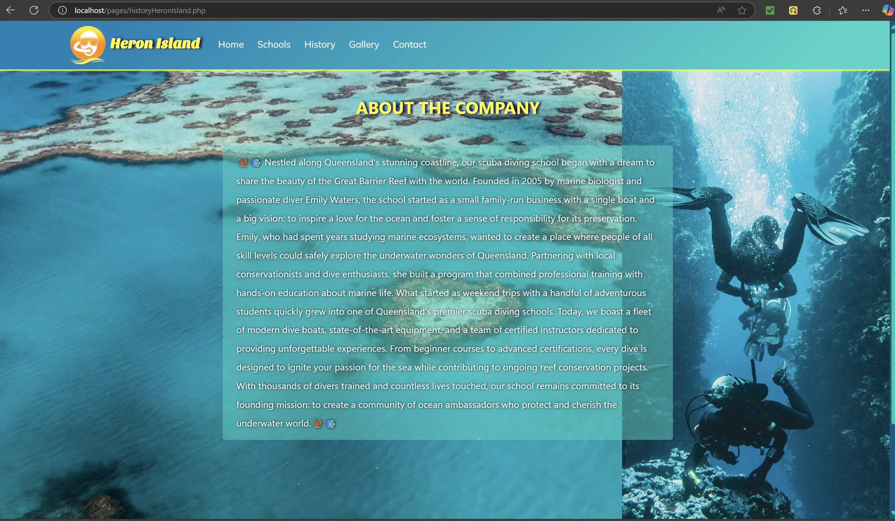

## 📄 Description

🪸🐠 This is a website project for a fictitious Scuba Diving company located in Gold Coast and Heron Island, Australia. 
The website is built with PHP and uses JavaScript to enhance user navigation and interactions, ensuring a smooth and intuitive experience. 🪸🪼    

* No frameworks
* No AI code
* Local content

The website is optimized for a 15.6" 1920 x 1080 display with a 16:9 aspect ratio.

## 📷 Screenshots

### index

### home

### about

### gallery

### contact

## 📒 How to run a local server

You can use MAMP or XAMPP as free options:

https://www.mamp.info/en/windows/

https://www.apachefriends.org/

MAMP EXAMPLE (XAMPP works in the same way):

If you followed the default installation parameters, the directory to run the local server should be on this path: 

   C:\MAMP

Steps to start the server:

1. Start the server by running the <strong>MAMP.exe</strong> file. Next, initiate the Apache Server and MySQL Server if they don't do it automatically

2. At the same directory level where MAMP.exe is located, look for the <strong>htdocs</strong> folder and delete it.

3. Replace the removed <strong>htdocs</strong> folder for the one on this project.

4. In your browser type the following URL: 

   127.0.0.1:80/phpMyAdmin5/

  

